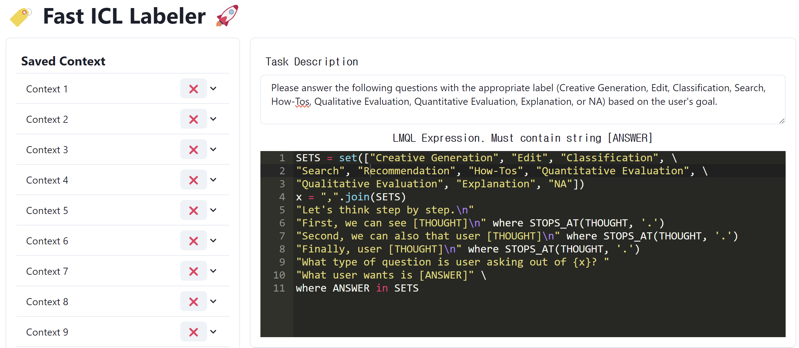

# Adaptive In-Context-Labeler

<center>
        
</center>

*Using In-Context Learning Capability, LMQL, and multi-armed bandit examplars for fast labeling pipeline*


Currently WIP, but feel free to try out.

Built with react, LMQL, fastap, replicate


## Demo

<center>
    
</center>
 
1. First, run frontend and backend server via

```bash
cd frontend
npm run start
cd ../backend
uvicorn main:app --reload
```

2. Run local server or use replicate backend. ("replicate:charles-dyfis-net/llama-2-13b-hf--lmtp-8bit")
  * For local server, for example, run `lmql serve-model meta-llama/Llama-2-13b-chat-hf --port 8010 --cuda --load_in_4bit True`
  * For replicate backend, don't run anything, instead, set osenv variables including [api token](https://replicate.com/account/api-tokens)

    ```
    export REPLICATE_API_TOKEN= ... # YOUR API TOKEN
    export MODEL_ID="meta-llama/Llama-2-13b-chat-hf"
    export ENDPOINT="replicate:charles-dyfis-net/llama-2-13b-hf--lmtp-8bit"
    ```

3. Use the app at `http://localhost:3000/`. You would have to have your data in backend/data.csv file, with `item_id,text,processed_value,is_processed` columns. You can use `backend/seed.py` as an example dataset creation.


